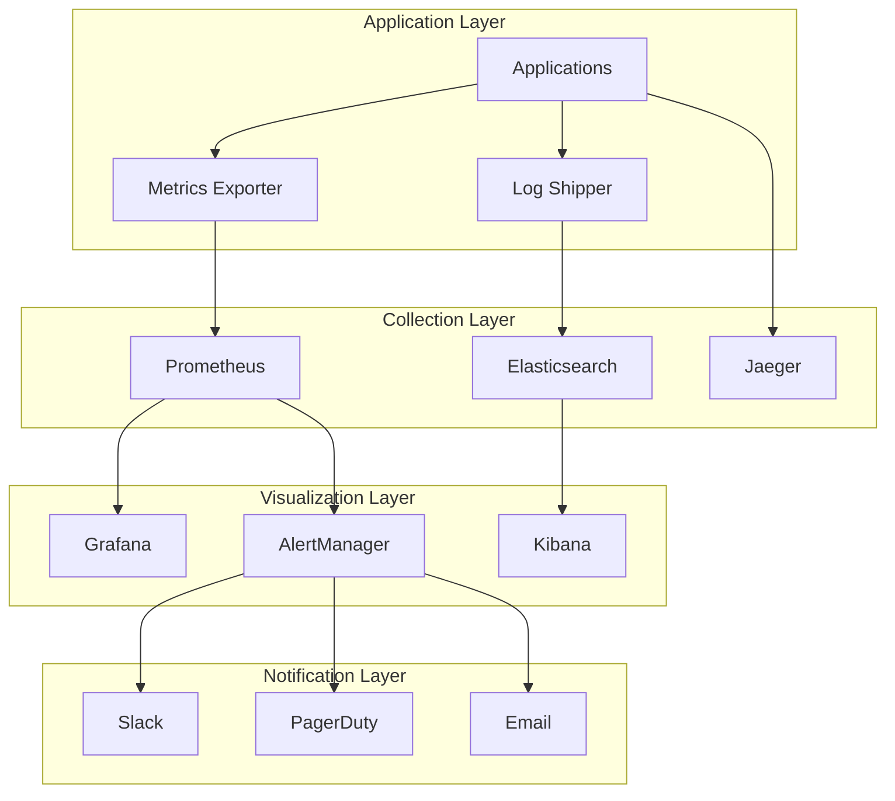

# Voice Agent Platform Monitoring & Operations Guide

## 1. Introduction

This guide covers monitoring, logging, alerting, and operational best practices for maintaining the Voice Agent Platform in production. It ensures high availability, performance, and quick incident resolution.

## 2. Monitoring Architecture

### 2.1 Overview



### 2.2 Key Metrics

```yaml
business_metrics:
  - active_agents: Total number of deployed agents
  - active_sessions: Current voice sessions
  - session_success_rate: Percentage of successful sessions
  - average_session_duration: Mean conversation length
  - tool_execution_rate: Tools called per session
  - escalation_rate: Sessions requiring human intervention

technical_metrics:
  - response_time_p95: 95th percentile API response time
  - websocket_connections: Active WebSocket connections
  - error_rate: HTTP 5xx errors per minute
  - cpu_utilization: CPU usage percentage
  - memory_usage: Memory consumption
  - database_connections: Active DB connections

openai_metrics:
  - api_calls_per_minute: OpenAI API request rate
  - token_usage: Tokens consumed per hour
  - api_latency: OpenAI API response time
  - api_errors: Failed API calls
  - cost_per_hour: Estimated OpenAI costs
```

## 3. Metrics Collection

### 3.1 Application Metrics

```typescript
// metrics/prometheus.ts
import { Registry, Counter, Histogram, Gauge } from 'prom-client';

const register = new Registry();

// Business metrics
export const activeAgents = new Gauge({
  name: 'voice_agent_active_agents_total',
  help: 'Total number of active agents',
  labelNames: ['tenant_id'],
  registers: [register]
});

export const activeSessions = new Gauge({
  name: 'voice_agent_active_sessions',
  help: 'Number of active voice sessions',
  labelNames: ['agent_id', 'tenant_id'],
  registers: [register]
});

export const sessionDuration = new Histogram({
  name: 'voice_agent_session_duration_seconds',
  help: 'Duration of voice sessions',
  labelNames: ['agent_id', 'status'],
  buckets: [30, 60, 120, 300, 600, 1200, 1800, 3600],
  registers: [register]
});

// Technical metrics
export const httpRequestDuration = new Histogram({
  name: 'http_request_duration_seconds',
  help: 'Duration of HTTP requests',
  labelNames: ['method', 'route', 'status'],
  buckets: [0.005, 0.01, 0.025, 0.05, 0.1, 0.25, 0.5, 1, 2.5, 5],
  registers: [register]
});

export const websocketConnections = new Gauge({
  name: 'websocket_connections_active',
  help: 'Number of active WebSocket connections',
  labelNames: ['agent_id'],
  registers: [register]
});

// OpenAI metrics
export const openaiApiCalls = new Counter({
  name: 'openai_api_calls_total',
  help: 'Total OpenAI API calls',
  labelNames: ['model', 'status'],
  registers: [register]
});

export const openaiTokenUsage = new Counter({
  name: 'openai_tokens_used_total',
  help: 'Total tokens used',
  labelNames: ['model', 'type'],
  registers: [register]
});

// Middleware
export function metricsMiddleware(req: Request, res: Response, next: NextFunction) {
  const start = Date.now();
  
  res.on('finish', () => {
    const duration = (Date.now() - start) / 1000;
    httpRequestDuration
      .labels(req.method, req.route?.path || req.path, res.statusCode.toString())
      .observe(duration);
  });
  
  next();
}
```

### 3.2 Custom Metrics

```typescript
// Track session lifecycle
export async function trackSessionStart(sessionId: string, agentId: string, tenantId: string) {
  activeSessions.labels(agentId, tenantId).inc();
  
  await redis.hset(`session:${sessionId}`, {
    startTime: Date.now(),
    agentId,
    tenantId,
    status: 'active'
  });
}

export async function trackSessionEnd(sessionId: string, status: 'completed' | 'error' | 'timeout') {
  const session = await redis.hgetall(`session:${sessionId}`);
  if (!session) return;
  
  const duration = (Date.now() - parseInt(session.startTime)) / 1000;
  sessionDuration.labels(session.agentId, status).observe(duration);
  activeSessions.labels(session.agentId, session.tenantId).dec();
  
  await redis.del(`session:${sessionId}`);
}

// Track tool execution
export function trackToolExecution(toolName: string, duration: number, success: boolean) {
  toolExecutions.labels(toolName, success ? 'success' : 'failure').inc();
  toolExecutionDuration.labels(toolName).observe(duration / 1000);
}
```

## 4. Logging Strategy

### 4.1 Structured Logging

```typescript
// logger/config.ts
import winston from 'winston';
import { ElasticsearchTransport } from 'winston-elasticsearch';

const esTransport = new ElasticsearchTransport({
  level: 'info',
  clientOpts: {
    node: process.env.ELASTICSEARCH_URL,
    auth: {
      username: process.env.ELASTICSEARCH_USER,
      password: process.env.ELASTICSEARCH_PASS
    }
  },
  index: 'voice-agent-logs',
  dataStream: true
});

export const logger = winston.createLogger({
  format: winston.format.combine(
    winston.format.timestamp(),
    winston.format.errors({ stack: true }),
    winston.format.json()
  ),
  defaultMeta: {
    service: 'voice-agent',
    environment: process.env.NODE_ENV,
    version: process.env.APP_VERSION
  },
  transports: [
    new winston.transports.Console({
      format: winston.format.combine(
        winston.format.colorize(),
        winston.format.simple()
      )
    }),
    esTransport
  ]
});

// Correlation ID middleware
export function correlationMiddleware(req: Request, res: Response, next: NextFunction) {
  const correlationId = req.headers['x-correlation-id'] || uuidv4();
  req.correlationId = correlationId;
  res.setHeader('X-Correlation-ID', correlationId);
  
  // Add to logger context
  logger.defaultMeta.correlationId = correlationId;
  next();
}
```

### 4.2 Log Levels and Categories

```typescript
// Session logging
logger.info('Session started', {
  category: 'session',
  sessionId,
  agentId,
  tenantId,
  userAgent: req.headers['user-agent'],
  ip: req.ip
});

// Error logging
logger.error('OpenAI API error', {
  category: 'openai',
  error: error.message,
  stack: error.stack,
  sessionId,
  request: {
    model: 'gpt-4o-realtime',
    tokens: estimatedTokens
  },
  response: {
    status: error.response?.status,
    data: error.response?.data
  }
});

// Performance logging
logger.info('Slow query detected', {
  category: 'performance',
  query: sql,
  duration: queryTime,
  threshold: 1000,
  params: sanitizedParams
});

// Security logging
logger.warn('Authentication failure', {
  category: 'security',
  reason: 'invalid_api_key',
  apiKey: maskApiKey(providedKey),
  ip: req.ip,
  userAgent: req.headers['user-agent']
});
```

## 5. Alerting Rules

### 5.1 Prometheus Alert Configuration

```yaml
# alerts/rules.yml
groups:
  - name: voice_agent_critical
    interval: 30s
    rules:
      - alert: HighErrorRate
        expr: |
          rate(http_requests_total{status=~"5.."}[5m]) > 0.05
        for: 5m
        labels:
          severity: critical
          team: platform
        annotations:
          summary: "High error rate detected"
          description: "Error rate is {{ $value | humanizePercentage }} for {{ $labels.service }}"
          
      - alert: ServiceDown
        expr: up == 0
        for: 1m
        labels:
          severity: critical
          team: platform
        annotations:
          summary: "Service {{ $labels.job }} is down"
          description: "{{ $labels.instance }} has been down for more than 1 minute"
          
      - alert: HighMemoryUsage
        expr: |
          (node_memory_MemTotal_bytes - node_memory_MemAvailable_bytes) 
          / node_memory_MemTotal_bytes > 0.9
        for: 10m
        labels:
          severity: warning
          team: platform
        annotations:
          summary: "High memory usage detected"
          description: "Memory usage is {{ $value | humanizePercentage }}"

  - name: voice_agent_business
    interval: 1m
    rules:
      - alert: LowSessionSuccessRate
        expr: |
          rate(voice_agent_sessions_total{status="completed"}[15m]) 
          / rate(voice_agent_sessions_total[15m]) < 0.8
        for: 15m
        labels:
          severity: warning
          team: customer_success
        annotations:
          summary: "Low session success rate"
          description: "Success rate is {{ $value | humanizePercentage }}"
          
      - alert: HighEscalationRate
        expr: |
          rate(voice_agent_escalations_total[1h]) 
          / rate(voice_agent_sessions_total[1h]) > 0.2
        for: 30m
        labels:
          severity: warning
          team: customer_success
        annotations:
          summary: "High escalation rate"
          description: "{{ $value | humanizePercentage }} of sessions are being escalated"

  - name: voice_agent_cost
    interval: 5m
    rules:
      - alert: HighOpenAICost
        expr: |
          increase(openai_estimated_cost_dollars[1h]) > 100
        labels:
          severity: warning
          team: finance
        annotations:
          summary: "High OpenAI API costs"
          description: "Estimated cost in last hour: ${{ $value }}"
```

### 5.2 Alert Routing

```yaml
# alertmanager/config.yml
global:
  resolve_timeout: 5m
  slack_api_url: ${SLACK_WEBHOOK_URL}

route:
  group_by: ['alertname', 'cluster', 'service']
  group_wait: 10s
  group_interval: 10s
  repeat_interval: 12h
  receiver: 'default'
  routes:
    - match:
        severity: critical
      receiver: pagerduty
      continue: true
      
    - match:
        team: platform
      receiver: platform-slack
      
    - match:
        team: customer_success
      receiver: cs-slack
      
    - match:
        team: finance
      receiver: finance-email

receivers:
  - name: 'default'
    slack_configs:
      - channel: '#alerts'
        title: 'Voice Agent Alert'
        text: '{{ range .Alerts }}{{ .Annotations.summary }}\n{{ .Annotations.description }}{{ end }}'
        
  - name: 'pagerduty'
    pagerduty_configs:
      - service_key: ${PAGERDUTY_SERVICE_KEY}
        description: '{{ .GroupLabels.alertname }}'
        
  - name: 'platform-slack'
    slack_configs:
      - channel: '#platform-alerts'
        send_resolved: true
        
  - name: 'cs-slack'
    slack_configs:
      - channel: '#customer-success'
        send_resolved: true
        
  - name: 'finance-email'
    email_configs:
      - to: 'finance@voiceagent.com'
        from: 'alerts@voiceagent.com'
        headers:
          Subject: 'Cost Alert: {{ .GroupLabels.alertname }}'
```

## 6. Dashboards

### 6.1 Executive Dashboard

```json
{
  "dashboard": {
    "title": "Voice Agent Executive Dashboard",
    "panels": [
      {
        "title": "Active Agents",
        "type": "stat",
        "targets": [{
          "expr": "sum(voice_agent_active_agents_total)"
        }]
      },
      {
        "title": "Current Sessions",
        "type": "stat",
        "targets": [{
          "expr": "sum(voice_agent_active_sessions)"
        }]
      },
      {
        "title": "Session Success Rate",
        "type": "gauge",
        "targets": [{
          "expr": "rate(voice_agent_sessions_total{status=\"completed\"}[1h]) / rate(voice_agent_sessions_total[1h]) * 100"
        }]
      },
      {
        "title": "Daily Active Users",
        "type": "graph",
        "targets": [{
          "expr": "count(count by (user_id) (voice_agent_sessions_total[1d]))"
        }]
      },
      {
        "title": "Revenue Impact",
        "type": "stat",
        "targets": [{
          "expr": "sum(voice_agent_revenue_dollars)"
        }]
      }
    ]
  }
}
```

### 6.2 Operations Dashboard

```json
{
  "dashboard": {
    "title": "Voice Agent Operations",
    "panels": [
      {
        "title": "API Response Time",
        "type": "graph",
        "targets": [{
          "expr": "histogram_quantile(0.95, http_request_duration_seconds_bucket)"
        }]
      },
      {
        "title": "Error Rate",
        "type": "graph",
        "targets": [{
          "expr": "rate(http_requests_total{status=~\"5..\"}[5m])"
        }]
      },
      {
        "title": "WebSocket Connections",
        "type": "graph",
        "targets": [{
          "expr": "sum(websocket_connections_active)"
        }]
      },
      {
        "title": "Database Connections",
        "type": "graph",
        "targets": [{
          "expr": "pg_stat_database_numbackends"
        }]
      },
      {
        "title": "CPU Usage",
        "type": "graph",
        "targets": [{
          "expr": "100 - (avg(irate(node_cpu_seconds_total{mode=\"idle\"}[5m])) * 100)"
        }]
      },
      {
        "title": "Memory Usage",
        "type": "graph",
        "targets": [{
          "expr": "(node_memory_MemTotal_bytes - node_memory_MemAvailable_bytes) / node_memory_MemTotal_bytes * 100"
        }]
      }
    ]
  }
}
```

## 7. Incident Response

### 7.1 Runbooks

#### High Error Rate Runbook
```markdown
## Alert: High Error Rate

### Symptoms
- Error rate > 5% for 5 minutes
- Users reporting failed sessions
- Increased support tickets

### Investigation Steps
1. Check error logs:
   ```
   kubectl logs -n voice-agent -l app=voice-agent-api --tail=100 | grep ERROR
   ```

2. Check specific error types:
   ```
   curl -X POST http://elasticsearch:9200/voice-agent-logs/_search -d '{
     "query": {
       "bool": {
         "must": [
           {"term": {"level": "error"}},
           {"range": {"@timestamp": {"gte": "now-15m"}}}
         ]
       }
     },
     "aggs": {
       "error_types": {
         "terms": {"field": "error.type"}
       }
     }
   }'
   ```

3. Check OpenAI API status:
   ```
   curl https://status.openai.com/api/v2/status.json
   ```

### Resolution Steps
1. If OpenAI issue:
   - Enable fallback mode
   - Notify customers of degraded service
   
2. If database issue:
   - Check connection pool
   - Restart connection pool if needed
   - Scale read replicas
   
3. If application error:
   - Identify problematic endpoint
   - Deploy hotfix or rollback

### Escalation
- After 15 minutes: Page on-call engineer
- After 30 minutes: Escalate to team lead
- After 1 hour: Involve VP Engineering
```

### 7.2 On-Call Procedures

```yaml
on_call_rotation:
  schedule: weekly
  handoff: Monday 9am
  team_size: 6
  
  responsibilities:
    - Monitor alerts 24/7
    - Respond within 15 minutes
    - Execute runbooks
    - Escalate when needed
    - Document incidents
    
  tools:
    - PagerDuty mobile app
    - VPN access
    - Admin dashboard access
    - Kubernetes access
    - Database read access
    
  escalation_path:
    L1: On-call engineer
    L2: Team lead
    L3: VP Engineering
    L4: CTO
```

## 8. Performance Monitoring

### 8.1 SLIs and SLOs

```yaml
service_level_indicators:
  availability:
    description: Percentage of successful health checks
    query: avg_over_time(up[5m])
    
  latency:
    description: 95th percentile response time
    query: histogram_quantile(0.95, http_request_duration_seconds_bucket)
    
  error_rate:
    description: Percentage of 5xx responses
    query: rate(http_requests_total{status=~"5.."}[5m]) / rate(http_requests_total[5m])
    
  session_success:
    description: Percentage of completed sessions
    query: rate(sessions_total{status="completed"}[1h]) / rate(sessions_total[1h])

service_level_objectives:
  - sli: availability
    target: 99.9%
    window: 30d
    
  - sli: latency
    target: < 500ms
    window: 7d
    
  - sli: error_rate
    target: < 1%
    window: 7d
    
  - sli: session_success
    target: > 90%
    window: 30d
```

### 8.2 Performance Profiling

```typescript
// Enable profiling endpoint
app.get('/debug/pprof/profile', async (req, res) => {
  const duration = parseInt(req.query.seconds as string) || 30;
  
  // Start CPU profiling
  profiler.startProfiling('CPU profile');
  
  setTimeout(() => {
    const profile = profiler.stopProfiling();
    profile.export((error, result) => {
      if (error) {
        res.status(500).send(error.message);
        return;
      }
      res.setHeader('Content-Type', 'application/json');
      res.send(result);
      profile.delete();
    });
  }, duration * 1000);
});

// Memory profiling
app.get('/debug/pprof/heap', (req, res) => {
  const snapshot = v8.writeHeapSnapshot();
  res.setHeader('Content-Type', 'application/json');
  res.send(snapshot);
});
```

## 9. Capacity Planning

### 9.1 Resource Forecasting

```sql
-- Session growth projection
WITH daily_sessions AS (
  SELECT 
    DATE(created_at) as date,
    COUNT(*) as session_count
  FROM sessions
  WHERE created_at > NOW() - INTERVAL '90 days'
  GROUP BY DATE(created_at)
),
growth_rate AS (
  SELECT 
    AVG(session_count) as avg_sessions,
    REGR_SLOPE(session_count, EXTRACT(epoch FROM date)) as growth_rate
  FROM daily_sessions
)
SELECT 
  avg_sessions,
  growth_rate,
  avg_sessions + (growth_rate * 30 * 86400) as projected_30d,
  avg_sessions + (growth_rate * 90 * 86400) as projected_90d
FROM growth_rate;
```

### 9.2 Auto-Scaling Configuration

```yaml
# HPA configuration
apiVersion: autoscaling/v2
kind: HorizontalPodAutoscaler
metadata:
  name: voice-agent-api-hpa
spec:
  scaleTargetRef:
    apiVersion: apps/v1
    kind: Deployment
    name: voice-agent-api
  minReplicas: 3
  maxReplicas: 50
  metrics:
  - type: Resource
    resource:
      name: cpu
      target:
        type: Utilization
        averageUtilization: 70
  - type: Resource
    resource:
      name: memory
      target:
        type: Utilization
        averageUtilization: 80
  - type: Pods
    pods:
      metric:
        name: http_requests_per_second
      target:
        type: AverageValue
        averageValue: "1000"
  behavior:
    scaleDown:
      stabilizationWindowSeconds: 300
      policies:
      - type: Percent
        value: 10
        periodSeconds: 60
    scaleUp:
      stabilizationWindowSeconds: 0
      policies:
      - type: Percent
        value: 100
        periodSeconds: 15
      - type: Pods
        value: 4
        periodSeconds: 15
      selectPolicy: Max
```

## 10. Cost Monitoring

### 10.1 OpenAI Cost Tracking

```typescript
// Track OpenAI usage
export async function trackOpenAIUsage(
  model: string,
  inputTokens: number,
  outputTokens: number,
  sessionId: string
) {
  const costs = {
    'gpt-4o-realtime': {
      input: 0.00001, // $0.01 per 1K tokens
      output: 0.00003  // $0.03 per 1K tokens
    }
  };
  
  const cost = (inputTokens * costs[model].input + 
                outputTokens * costs[model].output) / 1000;
  
  // Update metrics
  openaiTokenUsage.labels(model, 'input').inc(inputTokens);
  openaiTokenUsage.labels(model, 'output').inc(outputTokens);
  openaiCostTotal.labels(model).inc(cost);
  
  // Store in database for billing
  await db.openaiUsage.create({
    data: {
      sessionId,
      model,
      inputTokens,
      outputTokens,
      cost,
      timestamp: new Date()
    }
  });
}
```

### 10.2 Cost Optimization Alerts

```yaml
- alert: HighTokenUsagePerSession
  expr: |
    avg(increase(openai_tokens_used_total[1h]) / 
    increase(voice_agent_sessions_total[1h])) > 10000
  labels:
    severity: warning
    team: engineering
  annotations:
    summary: "High token usage per session"
    description: "Average {{ $value }} tokens per session"
    
- alert: UnusualCostSpike
  expr: |
    increase(openai_estimated_cost_dollars[1h]) > 
    avg(increase(openai_estimated_cost_dollars[1h] offset 1d)) * 2
  labels:
    severity: warning
    team: finance
  annotations:
    summary: "Unusual cost spike detected"
    description: "Current hourly cost 2x higher than yesterday"
```

## 11. Maintenance Windows

### 11.1 Scheduled Maintenance

```typescript
// Maintenance mode
export class MaintenanceMode {
  private static instance: MaintenanceMode;
  private inMaintenance = false;
  private scheduledEnd?: Date;
  
  static getInstance() {
    if (!this.instance) {
      this.instance = new MaintenanceMode();
    }
    return this.instance;
  }
  
  async enable(duration: number, message?: string) {
    this.inMaintenance = true;
    this.scheduledEnd = new Date(Date.now() + duration);
    
    // Notify all active sessions
    await this.notifyActiveSessions(message || 'System maintenance in progress');
    
    // Update status page
    await this.updateStatusPage('maintenance', message);
    
    // Set auto-disable
    setTimeout(() => this.disable(), duration);
  }
  
  async disable() {
    this.inMaintenance = false;
    this.scheduledEnd = undefined;
    
    await this.updateStatusPage('operational');
  }
  
  middleware() {
    return (req: Request, res: Response, next: NextFunction) => {
      if (this.inMaintenance && !this.isWhitelisted(req)) {
        res.status(503).json({
          error: 'Service Unavailable',
          message: 'System maintenance in progress',
          estimatedEnd: this.scheduledEnd
        });
        return;
      }
      next();
    };
  }
}
```

## 12. Backup and Recovery

### 12.1 Automated Backups

```bash
#!/bin/bash
# backup.sh - Run via cron every 6 hours

set -e

TIMESTAMP=$(date +%Y%m%d_%H%M%S)
BACKUP_DIR="/backups/${TIMESTAMP}"
S3_BUCKET="voice-agent-backups"

# Create backup directory
mkdir -p ${BACKUP_DIR}

# Backup PostgreSQL
echo "Backing up PostgreSQL..."
pg_dump -h ${DB_HOST} -U ${DB_USER} -d voice_agent \
  -F custom -b -v -f "${BACKUP_DIR}/postgres.dump"

# Backup Redis
echo "Backing up Redis..."
redis-cli -h ${REDIS_HOST} --rdb "${BACKUP_DIR}/redis.rdb"

# Backup configurations
echo "Backing up configurations..."
kubectl get configmaps -n voice-agent -o yaml > "${BACKUP_DIR}/configmaps.yaml"
kubectl get secrets -n voice-agent -o yaml > "${BACKUP_DIR}/secrets.yaml"

# Compress and upload to S3
tar -czf "${BACKUP_DIR}.tar.gz" -C /backups ${TIMESTAMP}
aws s3 cp "${BACKUP_DIR}.tar.gz" "s3://${S3_BUCKET}/backups/"

# Clean up local files
rm -rf ${BACKUP_DIR} "${BACKUP_DIR}.tar.gz"

# Verify backup
aws s3 ls "s3://${S3_BUCKET}/backups/${TIMESTAMP}.tar.gz"

echo "Backup completed successfully"
```

### 12.2 Recovery Procedures

```bash
#!/bin/bash
# restore.sh - Restore from backup

set -e

BACKUP_DATE=$1
S3_BUCKET="voice-agent-backups"
RESTORE_DIR="/tmp/restore"

if [ -z "$BACKUP_DATE" ]; then
  echo "Usage: ./restore.sh YYYYMMDD_HHMMSS"
  exit 1
fi

# Download backup
mkdir -p ${RESTORE_DIR}
aws s3 cp "s3://${S3_BUCKET}/backups/${BACKUP_DATE}.tar.gz" "${RESTORE_DIR}/"
tar -xzf "${RESTORE_DIR}/${BACKUP_DATE}.tar.gz" -C ${RESTORE_DIR}

# Restore PostgreSQL
echo "Restoring PostgreSQL..."
pg_restore -h ${DB_HOST} -U ${DB_USER} -d voice_agent_restore \
  -v "${RESTORE_DIR}/${BACKUP_DATE}/postgres.dump"

# Restore Redis
echo "Restoring Redis..."
redis-cli -h ${REDIS_HOST} --pipe < "${RESTORE_DIR}/${BACKUP_DATE}/redis.rdb"

# Restore configurations
echo "Restoring configurations..."
kubectl apply -f "${RESTORE_DIR}/${BACKUP_DATE}/configmaps.yaml"
kubectl apply -f "${RESTORE_DIR}/${BACKUP_DATE}/secrets.yaml"

# Clean up
rm -rf ${RESTORE_DIR}

echo "Restore completed successfully"
```

## 13. Conclusion

This monitoring and operations guide provides comprehensive coverage of maintaining the Voice Agent Platform in production. Regular review and updates of monitoring rules, dashboards, and procedures ensure optimal platform performance and reliability. 