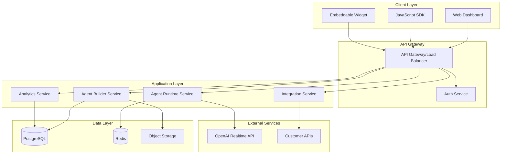
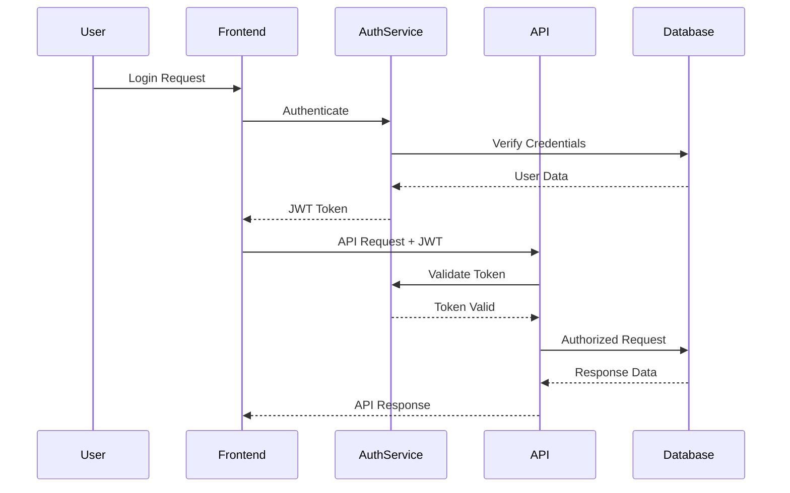

# Voice Agent Platform Architecture

## Executive Summary

This document outlines the architecture for transforming the OpenAI Realtime Agents demo into a production-ready, multi-tenant voice agent platform for small and medium businesses. The platform will enable businesses to create, deploy, and manage AI voice agents without coding.

## System Overview

### Core Components



## Architecture Principles

### 1. Multi-Tenancy
- **Tenant Isolation**: Each customer (tenant) has isolated data and configurations
- **Resource Quotas**: Per-tenant limits on API calls, storage, and concurrent sessions
- **Custom Domains**: Support for white-labeling with custom domains

### 2. Security First
- **Zero Trust Architecture**: Every request is authenticated and authorized
- **End-to-End Encryption**: TLS 1.3 for transit, AES-256 for data at rest
- **API Key Management**: Secure generation, rotation, and revocation of API keys
- **RBAC**: Role-based access control for team collaboration

### 3. Scalability
- **Horizontal Scaling**: Stateless services that can scale based on load
- **Database Sharding**: Tenant-based sharding for database scalability
- **Caching Strategy**: Multi-level caching with Redis
- **Queue Management**: Background job processing with BullMQ

### 4. High Availability
- **Multi-Region Deployment**: Active-active deployment across regions
- **Automatic Failover**: Health checks and automatic failover
- **Circuit Breakers**: Prevent cascade failures
- **Graceful Degradation**: Fallback mechanisms for external services

## Service Architecture

### 1. Agent Builder Service
**Purpose**: Manages agent creation, configuration, and versioning

**Responsibilities**:
- Visual flow designer backend
- Agent template management
- Version control for agent configurations
- Tool/function registry
- Validation and testing

**Technology Stack**:
- Next.js API Routes with tRPC
- PostgreSQL for configuration storage
- S3 for asset storage

### 2. Agent Runtime Service
**Purpose**: Executes voice agents in real-time

**Responsibilities**:
- WebSocket connection management
- Session state management
- Real-time audio processing
- Integration with OpenAI Realtime API
- Context and memory management

**Technology Stack**:
- Node.js with WebSocket support
- Redis for session state
- OpenAI Realtime SDK

### 3. Integration Service
**Purpose**: Connects agents to external systems

**Responsibilities**:
- API connector framework
- Webhook management
- Data transformation
- Authentication proxy
- Rate limiting and retry logic

**Technology Stack**:
- Node.js with Express
- PostgreSQL for connection configs
- Redis for rate limiting

### 4. Analytics Service
**Purpose**: Provides insights and monitoring

**Responsibilities**:
- Conversation analytics
- Performance metrics
- Usage tracking
- Cost analysis
- Custom reporting

**Technology Stack**:
- Time-series database (InfluxDB/TimescaleDB)
- Grafana for visualization
- Custom Next.js dashboards

## Data Architecture

### Database Schema (Core Tables)

```sql
-- Tenants (Organizations)
CREATE TABLE tenants (
    id UUID PRIMARY KEY,
    name VARCHAR(255) NOT NULL,
    plan VARCHAR(50) NOT NULL,
    created_at TIMESTAMP DEFAULT NOW(),
    settings JSONB
);

-- Users
CREATE TABLE users (
    id UUID PRIMARY KEY,
    tenant_id UUID REFERENCES tenants(id),
    email VARCHAR(255) UNIQUE NOT NULL,
    role VARCHAR(50) NOT NULL,
    created_at TIMESTAMP DEFAULT NOW()
);

-- Agents
CREATE TABLE agents (
    id UUID PRIMARY KEY,
    tenant_id UUID REFERENCES tenants(id),
    name VARCHAR(255) NOT NULL,
    version INTEGER NOT NULL,
    config JSONB NOT NULL,
    status VARCHAR(50) NOT NULL,
    created_by UUID REFERENCES users(id),
    created_at TIMESTAMP DEFAULT NOW()
);

-- Agent Deployments
CREATE TABLE deployments (
    id UUID PRIMARY KEY,
    agent_id UUID REFERENCES agents(id),
    environment VARCHAR(50) NOT NULL,
    endpoint_url VARCHAR(255),
    status VARCHAR(50) NOT NULL,
    deployed_at TIMESTAMP DEFAULT NOW()
);

-- Conversations
CREATE TABLE conversations (
    id UUID PRIMARY KEY,
    deployment_id UUID REFERENCES deployments(id),
    session_id VARCHAR(255) UNIQUE NOT NULL,
    started_at TIMESTAMP DEFAULT NOW(),
    ended_at TIMESTAMP,
    metadata JSONB
);

-- Integration Connections
CREATE TABLE connections (
    id UUID PRIMARY KEY,
    tenant_id UUID REFERENCES tenants(id),
    name VARCHAR(255) NOT NULL,
    type VARCHAR(50) NOT NULL,
    config JSONB NOT NULL,
    created_at TIMESTAMP DEFAULT NOW()
);
```

### Caching Strategy

1. **L1 Cache**: In-memory cache for frequently accessed configs
2. **L2 Cache**: Redis for session state and temporary data
3. **L3 Cache**: CDN for static assets and agent widgets

## Security Architecture

### Authentication & Authorization



### API Security
- **Rate Limiting**: Per-tenant and per-endpoint limits
- **API Key Scoping**: Keys limited to specific operations
- **Request Signing**: HMAC-SHA256 for webhook security
- **IP Whitelisting**: Optional IP restrictions per tenant

### Data Security
- **Encryption at Rest**: AES-256-GCM for sensitive data
- **Field-level Encryption**: For PII and sensitive fields
- **Audit Logging**: Comprehensive audit trail
- **Data Retention**: Configurable retention policies

## Deployment Architecture

### Infrastructure as Code

```yaml
# kubernetes/deployment.yaml
apiVersion: apps/v1
kind: Deployment
metadata:
  name: voice-agent-platform
spec:
  replicas: 3
  selector:
    matchLabels:
      app: voice-agent
  template:
    metadata:
      labels:
        app: voice-agent
    spec:
      containers:
      - name: web
        image: voice-agent-platform:latest
        ports:
        - containerPort: 3000
        env:
        - name: NODE_ENV
          value: "production"
        resources:
          requests:
            memory: "512Mi"
            cpu: "500m"
          limits:
            memory: "1Gi"
            cpu: "1000m"
```

### CI/CD Pipeline

1. **Development**: Feature branches → Dev environment
2. **Staging**: Main branch → Staging environment
3. **Production**: Tagged releases → Production environment

### Monitoring Stack

- **Application Monitoring**: Sentry for error tracking
- **Infrastructure Monitoring**: Prometheus + Grafana
- **Log Aggregation**: ELK Stack or CloudWatch
- **Synthetic Monitoring**: Uptime checks and performance tests

## Performance Optimization

### Frontend Optimization
- Server-side rendering for initial load
- Code splitting and lazy loading
- Edge caching with Vercel/Cloudflare
- Optimistic UI updates

### Backend Optimization
- Connection pooling for databases
- Query optimization and indexing
- Batch processing for bulk operations
- Async job processing

### Voice Processing Optimization
- WebRTC for low-latency audio
- Audio codec optimization
- Regional edge servers
- Predictive pre-loading

## Disaster Recovery

### Backup Strategy
- **Database**: Daily automated backups with point-in-time recovery
- **File Storage**: Cross-region replication
- **Configuration**: Version-controlled in Git

### Recovery Procedures
- **RTO**: 1 hour for critical services
- **RPO**: 15 minutes for transactional data
- **Runbooks**: Documented recovery procedures
- **Regular Drills**: Quarterly DR testing

## Cost Optimization

### Resource Management
- Auto-scaling based on demand
- Spot instances for non-critical workloads
- Reserved instances for baseline capacity
- Efficient data storage with lifecycle policies

### Usage Monitoring
- Per-tenant cost allocation
- OpenAI API usage tracking
- Storage optimization recommendations
- Performance vs. cost analysis

## Migration Path

### Phase 1: Foundation (Weeks 1-4)
- Set up development environment
- Implement basic multi-tenancy
- Create authentication system
- Set up CI/CD pipeline

### Phase 2: Core Platform (Weeks 5-8)
- Build agent configuration API
- Implement agent runtime service
- Create basic admin dashboard
- Set up monitoring

### Phase 3: Agent Builder (Weeks 9-12)
- Visual flow designer
- Template system
- Testing interface
- Version control

### Phase 4: Integration Layer (Weeks 13-16)
- API connector framework
- Webhook system
- Authentication proxy
- Data transformation

### Phase 5: Production Ready (Weeks 17-20)
- Performance optimization
- Security hardening
- Documentation
- Launch preparation

## Technology Stack Summary

### Frontend
- **Framework**: Next.js 15+ with App Router
- **Language**: TypeScript 5.0+
- **Styling**: Tailwind CSS + shadcn/ui
- **State Management**: Zustand/Jotai
- **API Client**: tRPC + React Query

### Backend
- **Runtime**: Node.js 20+ LTS
- **Framework**: Next.js 15+ API Routes with App Router
- **API Layer**: tRPC
- **Database**: PostgreSQL 15+ with Prisma
- **Cache**: Redis 7+
- **Queue**: BullMQ

### Integration Layer
- **MCP (Model Context Protocol)**: Native MCP server support
- **External APIs**: REST/GraphQL connectors
- **Custom Code**: Serverless function execution
- **WebSocket**: Socket.io for real-time communication

### Infrastructure
- **Container**: Docker
- **Orchestration**: Kubernetes/ECS
- **Cloud**: AWS/GCP/Azure
- **CDN**: Cloudflare/Vercel Edge
- **Monitoring**: DataDog/New Relic

### External Services
- **AI/Voice**: OpenAI Realtime API
- **Authentication**: Auth0/Clerk
- **Email**: SendGrid/Postmark
- **SMS**: Twilio
- **Storage**: AWS S3/Cloudflare R2

## Conclusion

This architecture provides a solid foundation for building a scalable, secure, and performant voice agent platform. It follows cloud-native principles and can be adapted based on specific requirements and constraints. 