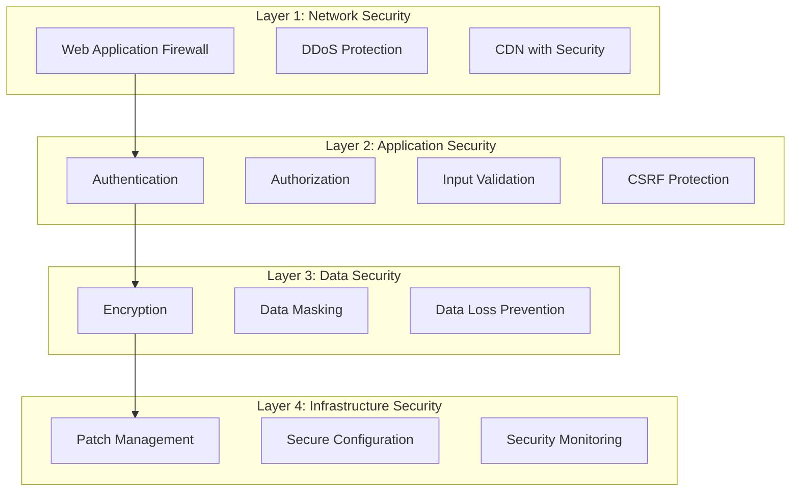

# Voice Agent Platform Security & Compliance Guide

## 1. Executive Summary

This document outlines the security measures, compliance requirements, and best practices for the Voice Agent Platform. It serves as a comprehensive guide for implementing and maintaining enterprise-grade security.

## 2. Security Architecture Overview

### 2.1 Defense in Depth Strategy



### 2.2 Zero Trust Principles

1. **Never Trust, Always Verify**: Every request is authenticated and authorized
2. **Least Privilege Access**: Users and services have minimal required permissions
3. **Assume Breach**: Design systems assuming attackers are already inside
4. **Verify Explicitly**: Use all available data points for authentication

## 3. Authentication & Authorization

### 3.1 Authentication Methods

#### Multi-Factor Authentication (MFA)
```typescript
interface MFAConfig {
  required: boolean;
  methods: {
    totp: boolean;      // Time-based OTP
    sms: boolean;       // SMS verification
    email: boolean;     // Email verification
    webauthn: boolean;  // Hardware keys
  };
  enforcement: {
    adminUsers: 'required';
    regularUsers: 'optional';
    apiAccess: 'required';
  };
}
```

#### OAuth 2.0 / OpenID Connect
```yaml
oauth_providers:
  google:
    client_id: ${GOOGLE_CLIENT_ID}
    scopes: [openid, email, profile]
  microsoft:
    client_id: ${AZURE_CLIENT_ID}
    tenant: common
  github:
    client_id: ${GITHUB_CLIENT_ID}
    scopes: [user:email]
```

#### API Key Authentication
```typescript
interface APIKeyStructure {
  prefix: 'vap_live_' | 'vap_test_';
  format: `${prefix}${random32chars}`;
  hash: 'sha256';
  rotation: '90 days';
  scopes: string[];
}
```

### 3.2 Authorization Model (RBAC)

```yaml
roles:
  super_admin:
    description: Platform administrator
    permissions:
      - '*'
    
  tenant_owner:
    description: Organization owner
    permissions:
      - 'tenant:*'
      - 'agents:*'
      - 'users:*'
      - 'billing:*'
    
  tenant_admin:
    description: Organization administrator
    permissions:
      - 'agents:*'
      - 'users:manage'
      - 'integrations:*'
      - 'analytics:view'
    
  developer:
    description: Agent developer
    permissions:
      - 'agents:create'
      - 'agents:update'
      - 'agents:test'
      - 'integrations:manage'
      - 'analytics:view'
    
  viewer:
    description: Read-only access
    permissions:
      - '*.read'
      - 'analytics:view'
```

### 3.3 Session Management

```typescript
interface SessionConfig {
  storage: 'redis';
  encryption: 'aes-256-gcm';
  timeout: {
    idle: '30 minutes';
    absolute: '8 hours';
  };
  renewal: {
    automatic: true;
    warningBefore: '5 minutes';
  };
  concurrent: {
    maxSessions: 3;
    action: 'terminate_oldest';
  };
}
```

## 4. Data Security

### 4.1 Encryption Standards

#### Encryption at Rest
```yaml
database:
  encryption: AES-256-GCM
  key_management: AWS KMS / Azure Key Vault
  key_rotation: 90 days
  
file_storage:
  encryption: AES-256-GCM
  client_side: true
  server_side: true
  
secrets:
  storage: HashiCorp Vault / AWS Secrets Manager
  encryption: AES-256-GCM
  access_control: IAM based
```

#### Encryption in Transit
```yaml
tls_configuration:
  minimum_version: TLS 1.3
  cipher_suites:
    - TLS_AES_256_GCM_SHA384
    - TLS_CHACHA20_POLY1305_SHA256
    - TLS_AES_128_GCM_SHA256
  certificate:
    type: EV SSL
    provider: DigiCert / Let's Encrypt
    renewal: automatic
  hsts:
    enabled: true
    max_age: 31536000
    include_subdomains: true
    preload: true
```

### 4.2 Data Classification & Handling

```yaml
data_classification:
  public:
    description: Public information
    encryption: optional
    retention: unlimited
    
  internal:
    description: Internal use only
    encryption: required
    retention: 2 years
    
  confidential:
    description: Sensitive business data
    encryption: required
    masking: required
    retention: 1 year
    
  restricted:
    description: PII and highly sensitive
    encryption: required
    masking: required
    tokenization: required
    retention: 90 days
```

### 4.3 PII Protection

```typescript
interface PIIProtection {
  fields: {
    email: 'hash_partial';      // user@d****n.com
    phone: 'mask_partial';      // ***-***-1234
    name: 'encrypt';
    address: 'tokenize';
    creditCard: 'tokenize';
    ssn: 'never_store';
  };
  
  methods: {
    hashing: 'sha256_with_salt';
    masking: 'character_replacement';
    tokenization: 'vault_based';
    encryption: 'field_level_aes256';
  };
}
```

## 5. Application Security

### 5.1 Input Validation & Sanitization

```typescript
// Input validation middleware
export const validateInput = {
  // SQL Injection Prevention
  sql: (input: string) => {
    const sqlPattern = /(\b(SELECT|INSERT|UPDATE|DELETE|DROP|UNION|ALTER)\b)/gi;
    return !sqlPattern.test(input);
  },
  
  // XSS Prevention
  xss: (input: string) => {
    return DOMPurify.sanitize(input, {
      ALLOWED_TAGS: ['b', 'i', 'em', 'strong'],
      ALLOWED_ATTR: []
    });
  },
  
  // Command Injection Prevention
  command: (input: string) => {
    const dangerousChars = /[;&|`$()]/g;
    return input.replace(dangerousChars, '');
  }
};
```

### 5.2 API Security

#### Rate Limiting
```yaml
rate_limits:
  global:
    requests_per_minute: 60
    requests_per_hour: 1000
    
  by_endpoint:
    /api/auth/*:
      requests_per_minute: 5
      lockout_after_failures: 5
      lockout_duration: 15 minutes
      
    /api/agents/*/deploy:
      requests_per_hour: 10
      
    /api/conversations/create:
      requests_per_minute: 100
      concurrent_limit: 50
```

#### API Security Headers
```typescript
export const securityHeaders = {
  'X-Content-Type-Options': 'nosniff',
  'X-Frame-Options': 'DENY',
  'X-XSS-Protection': '1; mode=block',
  'Referrer-Policy': 'strict-origin-when-cross-origin',
  'Content-Security-Policy': [
    "default-src 'self'",
    "script-src 'self' 'unsafe-inline' 'unsafe-eval'",
    "style-src 'self' 'unsafe-inline'",
    "img-src 'self' data: https:",
    "connect-src 'self' wss: https:",
    "font-src 'self'",
    "object-src 'none'",
    "frame-ancestors 'none'"
  ].join('; ')
};
```

### 5.3 Dependency Security

```yaml
dependency_management:
  scanning:
    tool: Snyk / Dependabot
    frequency: daily
    auto_fix: patch_versions
    
  policies:
    - no_vulnerable_dependencies
    - no_outdated_majors
    - license_compliance
    
  npm_audit:
    level: moderate
    action: fail_build
    
  supply_chain:
    verification: package_signatures
    registry: private_npm_registry
```

## 6. Infrastructure Security

### 6.1 Container Security

```dockerfile
# Secure Dockerfile practices
FROM node:20-alpine AS base
RUN apk add --no-cache libc6-compat
USER node

FROM base AS deps
WORKDIR /app
COPY --chown=node:node package*.json ./
RUN npm ci --only=production

FROM base AS build
WORKDIR /app
COPY --chown=node:node . .
RUN npm run build

FROM base AS runtime
WORKDIR /app
ENV NODE_ENV production
COPY --from=deps --chown=node:node /app/node_modules ./node_modules
COPY --from=build --chown=node:node /app/dist ./dist

EXPOSE 3000
CMD ["node", "dist/index.js"]
```

### 6.2 Kubernetes Security

```yaml
apiVersion: v1
kind: Pod
metadata:
  name: voice-agent-app
spec:
  securityContext:
    runAsNonRoot: true
    runAsUser: 1000
    fsGroup: 1000
  containers:
  - name: app
    image: voice-agent:latest
    securityContext:
      allowPrivilegeEscalation: false
      readOnlyRootFilesystem: true
      capabilities:
        drop:
          - ALL
    resources:
      limits:
        memory: "1Gi"
        cpu: "1000m"
      requests:
        memory: "512Mi"
        cpu: "500m"
```

### 6.3 Network Security

```yaml
network_policies:
  ingress:
    - allow_from: load_balancer
      ports: [443]
    - allow_from: monitoring
      ports: [9090]
      
  egress:
    - allow_to: database
      ports: [5432]
    - allow_to: redis
      ports: [6379]
    - allow_to: openai_api
      ports: [443]
      
firewall_rules:
  - source: 0.0.0.0/0
    destination: load_balancer
    ports: [443]
    action: allow
    
  - source: internal_network
    destination: any
    ports: [22]
    action: deny
```

## 7. Security Monitoring & Incident Response

### 7.1 Security Monitoring

```yaml
monitoring_stack:
  siem:
    tool: Splunk / ELK Stack
    log_sources:
      - application_logs
      - infrastructure_logs
      - security_events
      - audit_trails
      
  threat_detection:
    ids: Snort / Suricata
    behavioral: User Entity Behavior Analytics
    anomaly_detection: ML-based
    
  vulnerability_scanning:
    infrastructure: Weekly
    applications: Per deployment
    dependencies: Daily
```

### 7.2 Security Alerts

```yaml
alert_rules:
  - name: multiple_failed_logins
    condition: failed_logins > 5 in 5 minutes
    severity: high
    action: [notify_security, block_ip]
    
  - name: privilege_escalation
    condition: role_change to admin
    severity: critical
    action: [notify_security, require_mfa]
    
  - name: data_exfiltration
    condition: download_volume > 1GB in 1 hour
    severity: critical
    action: [notify_security, suspend_account]
    
  - name: api_abuse
    condition: api_calls > rate_limit * 2
    severity: medium
    action: [throttle, notify_ops]
```

### 7.3 Incident Response Plan

```yaml
incident_response:
  phases:
    1_detection:
      - automated_alerts
      - manual_reports
      - threat_hunting
      
    2_analysis:
      - severity_assessment
      - impact_analysis
      - root_cause_analysis
      
    3_containment:
      - isolate_affected_systems
      - preserve_evidence
      - prevent_spread
      
    4_eradication:
      - remove_threat
      - patch_vulnerabilities
      - update_defenses
      
    5_recovery:
      - restore_services
      - verify_integrity
      - monitor_closely
      
    6_lessons_learned:
      - post_mortem
      - update_procedures
      - training_updates
```

## 8. Compliance Requirements

### 8.1 GDPR Compliance

```yaml
gdpr_requirements:
  lawful_basis:
    - consent
    - legitimate_interest
    - contractual_necessity
    
  data_subject_rights:
    access:
      response_time: 30 days
      format: machine_readable
      
    rectification:
      process: automated_ui
      verification: required
      
    erasure:
      types: [soft_delete, hard_delete]
      exceptions: legal_retention
      
    portability:
      format: JSON/CSV
      delivery: secure_download
      
  privacy_by_design:
    - data_minimization
    - purpose_limitation
    - default_privacy_settings
    - transparent_processing
```

### 8.2 SOC 2 Type II Controls

```yaml
soc2_controls:
  security:
    - access_controls
    - encryption
    - firewall_configuration
    - vulnerability_management
    - incident_response
    
  availability:
    - redundancy
    - backup_procedures
    - disaster_recovery
    - performance_monitoring
    - incident_management
    
  processing_integrity:
    - quality_assurance
    - input_validation
    - output_reconciliation
    - error_handling
    
  confidentiality:
    - data_classification
    - encryption_standards
    - access_restrictions
    - retention_policies
    
  privacy:
    - notice_and_consent
    - choice_and_consent
    - access
    - disclosure_to_third_parties
    - retention_and_disposal
```

### 8.3 Industry Standards

```yaml
certifications:
  iso_27001:
    status: planned
    scope: entire_platform
    audit_frequency: annual
    
  iso_27017:
    status: planned
    scope: cloud_services
    
  iso_27018:
    status: planned
    scope: pii_processing
    
  pci_dss:
    level: 4
    scope: payment_processing
    validation: SAQ-A
```

## 9. Security Operations

### 9.1 Vulnerability Management

```yaml
vulnerability_management:
  scanning:
    frequency:
      critical_systems: daily
      production: weekly
      development: monthly
      
    tools:
      - static_analysis: SonarQube
      - dynamic_analysis: OWASP ZAP
      - dependency_scan: Snyk
      - container_scan: Trivy
      
  patching:
    critical: within 24 hours
    high: within 7 days
    medium: within 30 days
    low: within 90 days
    
  reporting:
    internal: weekly
    executive: monthly
    compliance: quarterly
```

### 9.2 Security Training

```yaml
security_training:
  onboarding:
    - security_awareness
    - secure_coding_practices
    - data_handling
    - incident_reporting
    
  ongoing:
    frequency: quarterly
    topics:
      - phishing_simulation
      - owasp_top_10
      - privacy_regulations
      - emerging_threats
      
  role_specific:
    developers:
      - secure_sdlc
      - code_review_security
      - dependency_management
      
    operations:
      - infrastructure_security
      - incident_response
      - security_monitoring
```

### 9.3 Third-Party Security

```yaml
vendor_management:
  assessment:
    - security_questionnaire
    - soc2_report_review
    - penetration_test_results
    - insurance_verification
    
  ongoing_monitoring:
    - quarterly_reviews
    - incident_notifications
    - compliance_updates
    
  data_processing_agreements:
    required_clauses:
      - data_protection
      - breach_notification
      - audit_rights
      - termination_procedures
```

## 10. Security Checklist

### 10.1 Pre-Deployment Checklist

- [ ] All dependencies scanned and updated
- [ ] Security headers configured
- [ ] SSL/TLS properly configured
- [ ] Authentication mechanisms tested
- [ ] Authorization rules verified
- [ ] Input validation implemented
- [ ] Rate limiting configured
- [ ] Logging and monitoring active
- [ ] Backup procedures tested
- [ ] Incident response plan reviewed

### 10.2 Production Security Checklist

- [ ] MFA enabled for all admin accounts
- [ ] API keys rotated quarterly
- [ ] Security patches up to date
- [ ] Firewall rules reviewed
- [ ] Access logs monitored
- [ ] Anomaly detection active
- [ ] Backup restoration tested
- [ ] Security training completed
- [ ] Compliance audits passed
- [ ] Penetration test conducted

## 11. Security Contacts

```yaml
security_contacts:
  security_team:
    email: security@voiceagent.com
    phone: +1-xxx-xxx-xxxx
    oncall: security-oncall@voiceagent.com
    
  incident_response:
    email: incident@voiceagent.com
    phone: +1-xxx-xxx-xxxx
    escalation: ciso@voiceagent.com
    
  bug_bounty:
    platform: HackerOne
    scope: *.voiceagent.com
    rewards: $100 - $10,000
    
  compliance:
    email: compliance@voiceagent.com
    dpo: privacy@voiceagent.com
```

## 12. Conclusion

Security is not a one-time implementation but an ongoing process. This guide should be reviewed and updated quarterly to address new threats, compliance requirements, and platform changes. All team members are responsible for maintaining the security posture of the Voice Agent Platform. 