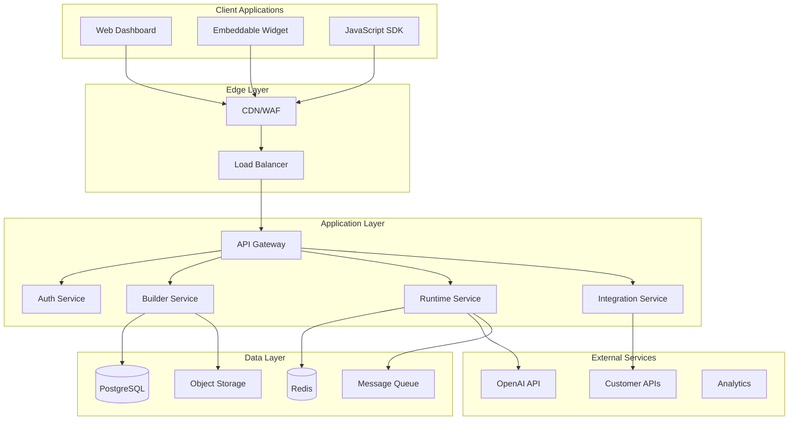

# Voice Agent Platform Technical Requirements

## 1. Executive Summary

This document outlines the technical requirements for building a production-ready voice agent platform. It covers functional requirements, non-functional requirements, technical constraints, and integration specifications.

## 2. System Requirements

### 2.1 Functional Requirements

#### FR-001: User Management
- **Description**: Multi-tenant user and team management system
- **Priority**: P0 (Critical)
- **Acceptance Criteria**:
  - Users can register with email/password or OAuth
  - Support for team invitations and role management
  - API key generation and management
  - User profile management

#### FR-002: Agent Builder
- **Description**: Visual interface for creating voice agents
- **Priority**: P0 (Critical)
- **Acceptance Criteria**:
  - Drag-and-drop flow designer
  - Node-based conversation design
  - Tool/function configuration UI
  - Real-time preview and testing

#### FR-003: Agent Runtime
- **Description**: Execute voice agents in real-time
- **Priority**: P0 (Critical)
- **Acceptance Criteria**:
  - WebSocket-based communication
  - Integration with OpenAI Realtime API
  - Session state management
  - Context persistence across turns

#### FR-004: Integration Framework
- **Description**: Connect agents to external systems
- **Priority**: P1 (High)
- **Acceptance Criteria**:
  - REST API connector
  - Webhook support
  - Authentication proxy
  - Data transformation tools

#### FR-005: Analytics & Monitoring
- **Description**: Track agent performance and usage
- **Priority**: P1 (High)
- **Acceptance Criteria**:
  - Conversation analytics
  - Performance metrics
  - Cost tracking
  - Custom reporting

#### FR-006: Template System
- **Description**: Pre-built agent templates and marketplace
- **Priority**: P2 (Medium)
- **Acceptance Criteria**:
  - Template library
  - Import/export functionality
  - Version management
  - Sharing capabilities

### 2.2 Non-Functional Requirements

#### NFR-001: Performance
- **Response Time**: 
  - API calls: < 500ms (p95)
  - Voice response latency: < 2s (p95)
  - Dashboard load time: < 2s
- **Throughput**:
  - 10,000 concurrent sessions
  - 100,000 API requests/minute
- **Resource Usage**:
  - CPU utilization < 70% under normal load
  - Memory usage < 80% of allocated

#### NFR-002: Scalability
- **Horizontal Scaling**: Support auto-scaling from 1 to 100 instances
- **Database**: Support sharding for 10,000+ tenants
- **Storage**: Unlimited agent configurations per tenant
- **Geographic Distribution**: Multi-region deployment capability

#### NFR-003: Availability
- **Uptime**: 99.9% SLA (43.8 minutes downtime/month)
- **Disaster Recovery**: RTO < 1 hour, RPO < 15 minutes
- **Failover**: Automatic failover within 30 seconds
- **Backup**: Daily automated backups with 30-day retention

#### NFR-004: Security
- **Authentication**: Multi-factor authentication support
- **Authorization**: Role-based access control (RBAC)
- **Encryption**: TLS 1.3 in transit, AES-256 at rest
- **Compliance**: GDPR, SOC 2 Type II ready
- **Audit**: Complete audit trail for all operations

#### NFR-005: Usability
- **Time to First Agent**: < 5 minutes
- **Learning Curve**: Basic agent creation without documentation
- **Accessibility**: WCAG 2.1 AA compliance
- **Mobile Support**: Responsive design for management UI

## 3. Technical Architecture

### 3.1 Technology Stack

#### Frontend
```yaml
framework: Next.js 15+
language: TypeScript 5.0+
styling: 
  - Tailwind CSS 3.0+
  - shadcn/ui components
state_management: 
  - Zustand (global state)
  - React Query (server state)
api_client: tRPC
testing: 
  - Jest
  - React Testing Library
  - Playwright (E2E)
```

#### Backend
```yaml
runtime: Node.js 20+ LTS
framework: Next.js 15+ API Routes with App Router
api_layer: tRPC
database: 
  - PostgreSQL 15+ (primary)
  - Redis 7+ (cache/sessions)
orm: Prisma 5+
queue: BullMQ
websocket: Socket.io
integrations:
  - MCP (Model Context Protocol)
  - External API connectors
  - Custom serverless functions
```

#### Infrastructure
```yaml
container: Docker
orchestration: Kubernetes 1.28+
cloud: AWS/GCP/Azure
cdn: Cloudflare
monitoring: 
  - DataDog/New Relic (APM)
  - Sentry (errors)
  - Grafana (metrics)
ci_cd: GitHub Actions
```

### 3.2 System Architecture



### 3.3 Database Schema

```sql
-- Core Tables
CREATE TABLE tenants (
    id UUID PRIMARY KEY DEFAULT gen_random_uuid(),
    name VARCHAR(255) NOT NULL,
    slug VARCHAR(255) UNIQUE NOT NULL,
    plan VARCHAR(50) NOT NULL,
    settings JSONB DEFAULT '{}',
    created_at TIMESTAMP DEFAULT NOW(),
    updated_at TIMESTAMP DEFAULT NOW()
);

CREATE TABLE users (
    id UUID PRIMARY KEY DEFAULT gen_random_uuid(),
    tenant_id UUID REFERENCES tenants(id) ON DELETE CASCADE,
    email VARCHAR(255) UNIQUE NOT NULL,
    password_hash VARCHAR(255),
    role VARCHAR(50) NOT NULL,
    profile JSONB DEFAULT '{}',
    created_at TIMESTAMP DEFAULT NOW(),
    updated_at TIMESTAMP DEFAULT NOW()
);

CREATE TABLE agents (
    id UUID PRIMARY KEY DEFAULT gen_random_uuid(),
    tenant_id UUID REFERENCES tenants(id) ON DELETE CASCADE,
    name VARCHAR(255) NOT NULL,
    description TEXT,
    config JSONB NOT NULL,
    version INTEGER DEFAULT 1,
    status VARCHAR(50) DEFAULT 'draft',
    created_by UUID REFERENCES users(id),
    created_at TIMESTAMP DEFAULT NOW(),
    updated_at TIMESTAMP DEFAULT NOW()
);

CREATE TABLE deployments (
    id UUID PRIMARY KEY DEFAULT gen_random_uuid(),
    agent_id UUID REFERENCES agents(id) ON DELETE CASCADE,
    environment VARCHAR(50) NOT NULL,
    endpoint_url VARCHAR(255) UNIQUE,
    config JSONB,
    status VARCHAR(50) DEFAULT 'inactive',
    deployed_at TIMESTAMP DEFAULT NOW()
);

CREATE TABLE conversations (
    id UUID PRIMARY KEY DEFAULT gen_random_uuid(),
    deployment_id UUID REFERENCES deployments(id),
    session_id VARCHAR(255) UNIQUE NOT NULL,
    started_at TIMESTAMP DEFAULT NOW(),
    ended_at TIMESTAMP,
    transcript JSONB,
    metadata JSONB,
    INDEX idx_session_id (session_id),
    INDEX idx_deployment_started (deployment_id, started_at)
);

CREATE TABLE api_keys (
    id UUID PRIMARY KEY DEFAULT gen_random_uuid(),
    tenant_id UUID REFERENCES tenants(id) ON DELETE CASCADE,
    name VARCHAR(255) NOT NULL,
    key_hash VARCHAR(255) UNIQUE NOT NULL,
    permissions JSONB DEFAULT '[]',
    last_used_at TIMESTAMP,
    expires_at TIMESTAMP,
    created_by UUID REFERENCES users(id),
    created_at TIMESTAMP DEFAULT NOW()
);

-- Indexes for performance
CREATE INDEX idx_agents_tenant ON agents(tenant_id);
CREATE INDEX idx_conversations_deployment ON conversations(deployment_id);
CREATE INDEX idx_users_tenant ON users(tenant_id);
```

## 4. API Specifications

### 4.1 REST API Endpoints

```yaml
# Authentication
POST   /api/auth/register
POST   /api/auth/login
POST   /api/auth/logout
POST   /api/auth/refresh
POST   /api/auth/forgot-password
POST   /api/auth/reset-password

# Agents
GET    /api/agents
POST   /api/agents
GET    /api/agents/:id
PUT    /api/agents/:id
DELETE /api/agents/:id
POST   /api/agents/:id/deploy
POST   /api/agents/:id/test

# Deployments
GET    /api/deployments
GET    /api/deployments/:id
PUT    /api/deployments/:id
DELETE /api/deployments/:id

# Conversations
GET    /api/conversations
GET    /api/conversations/:id
GET    /api/conversations/:id/transcript
DELETE /api/conversations/:id

# Integrations
GET    /api/integrations
POST   /api/integrations
GET    /api/integrations/:id
PUT    /api/integrations/:id
DELETE /api/integrations/:id
POST   /api/integrations/:id/test

# Analytics
GET    /api/analytics/usage
GET    /api/analytics/performance
GET    /api/analytics/costs
POST   /api/analytics/export
```

### 4.2 WebSocket Events

```typescript
// Client to Server
interface ClientEvents {
  'session.create': {
    deploymentId: string;
    metadata?: Record<string, any>;
  };
  
  'message.send': {
    sessionId: string;
    content: string;
    type: 'text' | 'audio';
  };
  
  'session.end': {
    sessionId: string;
  };
}

// Server to Client
interface ServerEvents {
  'session.created': {
    sessionId: string;
    agentConfig: AgentConfig;
  };
  
  'message.received': {
    sessionId: string;
    content: string;
    type: 'text' | 'audio';
    metadata?: Record<string, any>;
  };
  
  'tool.called': {
    sessionId: string;
    toolName: string;
    parameters: Record<string, any>;
  };
  
  'tool.result': {
    sessionId: string;
    toolName: string;
    result: any;
  };
  
  'error': {
    sessionId: string;
    code: string;
    message: string;
  };
}
```

### 4.3 SDK Interface

```typescript
// TypeScript SDK
class VoiceAgentClient {
  constructor(config: {
    apiKey: string;
    baseUrl?: string;
    options?: ClientOptions;
  });
  
  // Agent Management
  agents: {
    list(params?: ListParams): Promise<Agent[]>;
    get(id: string): Promise<Agent>;
    create(data: CreateAgentData): Promise<Agent>;
    update(id: string, data: UpdateAgentData): Promise<Agent>;
    delete(id: string): Promise<void>;
    deploy(id: string, env: string): Promise<Deployment>;
  };
  
  // Runtime
  sessions: {
    create(deploymentId: string): Promise<Session>;
    send(sessionId: string, message: Message): Promise<void>;
    end(sessionId: string): Promise<void>;
    onMessage(callback: MessageCallback): void;
    onError(callback: ErrorCallback): void;
  };
  
  // Analytics
  analytics: {
    getUsage(params: UsageParams): Promise<UsageData>;
    getPerformance(params: PerfParams): Promise<PerfData>;
    getCosts(params: CostParams): Promise<CostData>;
  };
}
```

## 5. Integration Requirements

### 5.1 OpenAI Integration

```typescript
interface OpenAIConfig {
  apiKey: string;
  model: 'gpt-4o-realtime' | 'gpt-4o-mini-realtime';
  temperature?: number;
  maxTokens?: number;
  tools?: Tool[];
  voice?: 'alloy' | 'echo' | 'fable' | 'onyx' | 'nova' | 'shimmer';
}

interface RealtimeSession {
  connect(): Promise<void>;
  send(event: RealtimeEvent): void;
  on(event: string, handler: Function): void;
  disconnect(): void;
}
```

### 5.2 External API Integration

```typescript
interface IntegrationConfig {
  id: string;
  name: string;
  type: 'rest' | 'graphql' | 'webhook' | 'database';
  authentication: {
    type: 'none' | 'apiKey' | 'oauth2' | 'basic';
    config: Record<string, any>;
  };
  endpoints: Endpoint[];
  rateLimit?: RateLimitConfig;
  timeout?: number;
}

interface Endpoint {
  id: string;
  name: string;
  method: string;
  path: string;
  parameters?: Parameter[];
  headers?: Record<string, string>;
  body?: BodyConfig;
  response?: ResponseConfig;
}
```

### 5.3 Webhook Specifications

```typescript
interface WebhookConfig {
  url: string;
  events: string[];
  secret?: string;
  headers?: Record<string, string>;
  retry?: {
    attempts: number;
    backoff: 'linear' | 'exponential';
    maxDelay: number;
  };
}

interface WebhookPayload {
  id: string;
  timestamp: string;
  event: string;
  data: Record<string, any>;
  signature?: string;
}
```

## 6. Security Requirements

### 6.1 Authentication & Authorization

```yaml
authentication:
  methods:
    - email_password:
        min_length: 8
        require_special_char: true
        require_number: true
    - oauth2:
        providers: [google, github, microsoft]
    - api_key:
        length: 32
        prefix: "vap_"
        
authorization:
  model: RBAC
  roles:
    - owner:
        permissions: ["*"]
    - admin:
        permissions: ["agents.*", "users.*", "integrations.*"]
    - developer:
        permissions: ["agents.*", "integrations.read"]
    - viewer:
        permissions: ["*.read"]
```

### 6.2 Data Security

```yaml
encryption:
  in_transit:
    protocol: TLS 1.3
    cipher_suites:
      - TLS_AES_256_GCM_SHA384
      - TLS_CHACHA20_POLY1305_SHA256
  at_rest:
    algorithm: AES-256-GCM
    key_management: AWS KMS / Azure Key Vault
    
data_protection:
  pii_fields:
    - users.email
    - users.profile
    - conversations.transcript
  retention:
    conversations: 90 days
    logs: 30 days
    analytics: 365 days
```

### 6.3 API Security

```yaml
rate_limiting:
  default:
    requests_per_minute: 60
    requests_per_hour: 1000
  by_endpoint:
    /api/agents/*/deploy: 10/hour
    /api/auth/*: 5/minute
    
api_security:
  - request_signing: HMAC-SHA256
  - ip_whitelisting: optional
  - cors:
      allowed_origins: ["https://*.voiceagent.com"]
      allowed_methods: ["GET", "POST", "PUT", "DELETE"]
  - headers:
      required: ["X-API-Key", "X-Request-ID"]
      security: ["X-Frame-Options", "X-Content-Type-Options"]
```

## 7. Performance Specifications

### 7.1 Response Time Requirements

| Operation | Target (p50) | Target (p95) | Target (p99) |
|-----------|--------------|--------------|--------------|
| API Read | 50ms | 200ms | 500ms |
| API Write | 100ms | 500ms | 1000ms |
| Voice Response | 500ms | 2000ms | 3000ms |
| Dashboard Load | 1000ms | 2000ms | 3000ms |
| WebSocket Connect | 100ms | 500ms | 1000ms |

### 7.2 Throughput Requirements

```yaml
concurrent_sessions: 10,000
messages_per_second: 50,000
api_requests_per_second: 5,000
storage_operations_per_second: 10,000
```

### 7.3 Resource Limits

```yaml
per_tenant:
  agents: 100
  deployments: 10
  concurrent_sessions: 1000
  api_calls_per_month: 1,000,000
  storage_gb: 100
  
per_agent:
  tools: 50
  nodes: 500
  variables: 100
  file_size_mb: 10
  
per_session:
  duration_minutes: 60
  messages: 1000
  context_tokens: 128,000
```

## 8. Monitoring & Observability

### 8.1 Metrics

```yaml
application_metrics:
  - request_rate
  - error_rate
  - response_time
  - concurrent_users
  - active_sessions
  
business_metrics:
  - agents_created
  - sessions_completed
  - messages_processed
  - api_usage
  - cost_per_session
  
infrastructure_metrics:
  - cpu_usage
  - memory_usage
  - disk_io
  - network_throughput
  - container_health
```

### 8.2 Logging

```yaml
log_levels: [debug, info, warn, error, fatal]
log_format: JSON
log_fields:
  - timestamp
  - level
  - service
  - trace_id
  - user_id
  - tenant_id
  - message
  - metadata
  
log_retention:
  debug: 1 day
  info: 7 days
  warn: 30 days
  error: 90 days
```

### 8.3 Alerting

```yaml
alerts:
  - name: high_error_rate
    condition: error_rate > 5%
    duration: 5 minutes
    severity: critical
    
  - name: low_availability
    condition: uptime < 99.9%
    duration: 10 minutes
    severity: critical
    
  - name: high_latency
    condition: p95_latency > 3s
    duration: 5 minutes
    severity: warning
    
  - name: quota_exceeded
    condition: usage > 90% of quota
    severity: warning
```

## 9. Development Guidelines

### 9.1 Code Standards

```yaml
language: TypeScript
style_guide: Airbnb
linting: ESLint + Prettier
type_checking: strict
test_coverage: minimum 80%
documentation: JSDoc for public APIs
```

### 9.2 Git Workflow

```yaml
branching_model: GitFlow
branch_naming:
  - feature/description
  - bugfix/description
  - hotfix/description
  - release/version
  
commit_format: Conventional Commits
pr_requirements:
  - code_review: 2 approvals
  - tests_passing: required
  - coverage_check: required
  - security_scan: required
```

### 9.3 Testing Requirements

```yaml
unit_tests:
  framework: Jest
  coverage: 80%
  mock_strategy: dependency injection
  
integration_tests:
  framework: Jest + Supertest
  database: test containers
  external_apis: mocked
  
e2e_tests:
  framework: Playwright
  browsers: [Chrome, Firefox, Safari]
  viewports: [desktop, tablet, mobile]
  
performance_tests:
  framework: K6
  scenarios: [load, stress, spike]
  thresholds: defined per endpoint
```

## 10. Deployment Requirements

### 10.1 Environments

```yaml
development:
  url: https://dev.voiceagent.com
  database: shared dev instance
  features: all enabled
  
staging:
  url: https://staging.voiceagent.com
  database: production-like
  features: production config
  
production:
  url: https://app.voiceagent.com
  database: multi-region cluster
  features: feature flags
```

### 10.2 CI/CD Pipeline

```yaml
pipeline:
  - stage: build
    steps:
      - install_dependencies
      - run_linter
      - run_type_check
      - build_application
      
  - stage: test
    steps:
      - run_unit_tests
      - run_integration_tests
      - check_coverage
      - security_scan
      
  - stage: deploy
    steps:
      - build_docker_image
      - push_to_registry
      - deploy_to_k8s
      - run_smoke_tests
      - monitor_deployment
```

### 10.3 Infrastructure as Code

```yaml
provider: Terraform
modules:
  - networking:
      vpc: true
      subnets: public + private
      security_groups: defined
      
  - compute:
      container_orchestration: EKS/GKE/AKS
      auto_scaling: enabled
      spot_instances: for non-critical
      
  - storage:
      database: RDS/Cloud SQL
      object_storage: S3/GCS
      cache: ElastiCache/Memorystore
      
  - monitoring:
      apm: DataDog/New Relic
      logs: CloudWatch/Stackdriver
      metrics: Prometheus + Grafana
```

## 11. Compliance & Regulations

### 11.1 Data Privacy

```yaml
gdpr:
  data_processing_agreement: required
  privacy_policy: required
  cookie_consent: required
  data_portability: supported
  right_to_deletion: supported
  
ccpa:
  privacy_notice: required
  opt_out: supported
  data_disclosure: supported
```

### 11.2 Security Compliance

```yaml
soc2_type_ii:
  controls: implemented
  audit: annual
  report: available to customers
  
iso_27001:
  certification: planned
  controls: aligned
  
pci_dss:
  level: 4 (tokenization used)
  scans: quarterly
```

## 12. Success Criteria

### 12.1 Technical Success Metrics

| Metric | Target | Measurement |
|--------|--------|-------------|
| Uptime | 99.9% | Monthly average |
| API Latency | <500ms p95 | Real-time monitoring |
| Error Rate | <1% | Daily average |
| Test Coverage | >80% | Per deployment |
| Security Score | A+ | Monthly scan |

### 12.2 Business Success Metrics

| Metric | Target | Timeline |
|--------|--------|----------|
| Time to First Agent | <5 min | Launch + 3 months |
| Active Tenants | 100+ | Launch + 6 months |
| Session Success Rate | >90% | Launch + 3 months |
| Customer Satisfaction | >4.5/5 | Ongoing |

## 13. Appendices

### 13.1 Glossary

- **Agent**: A configured voice AI assistant
- **Deployment**: A live instance of an agent
- **Session**: A single conversation between user and agent
- **Tenant**: A customer organization using the platform
- **Tool**: A function that an agent can call
- **Node**: A step in the agent's conversation flow

### 13.2 References

- OpenAI Realtime API Documentation
- Next.js 14 Documentation
- PostgreSQL 15 Documentation
- Kubernetes Best Practices
- OWASP Security Guidelines 